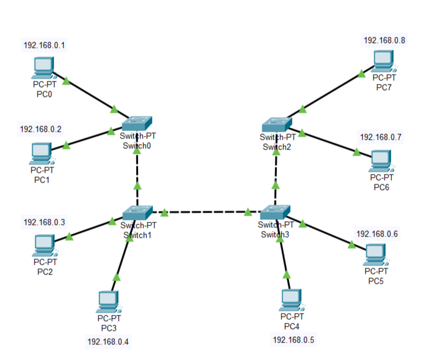
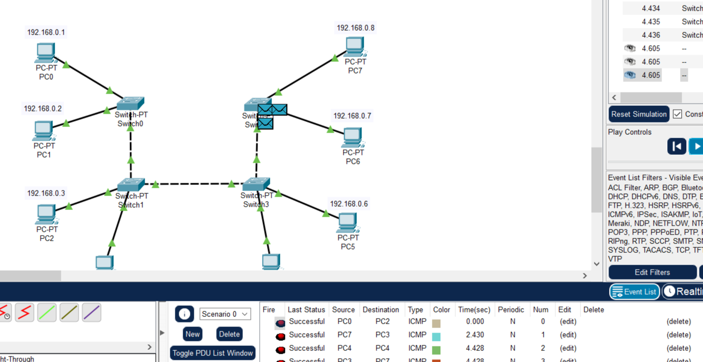
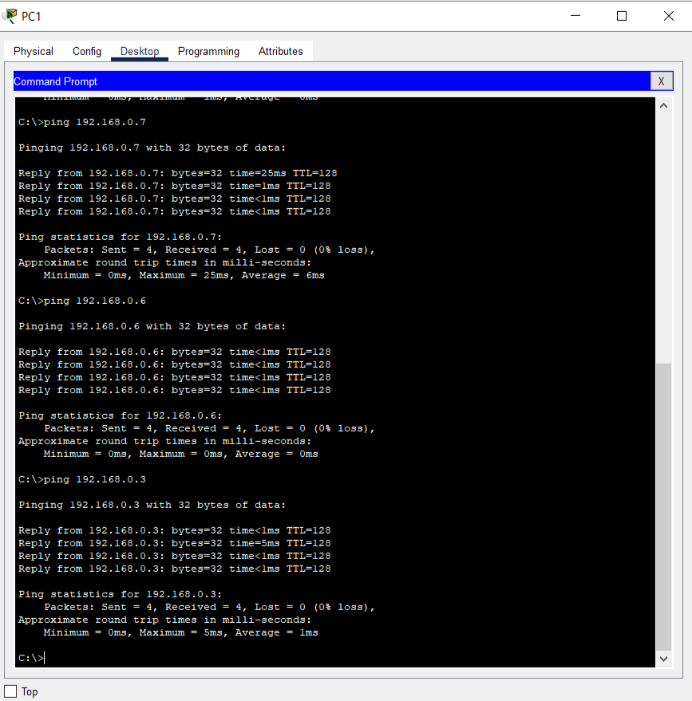
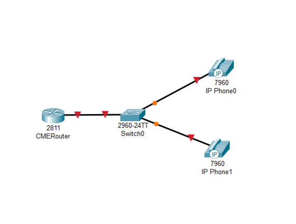
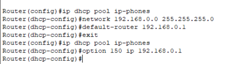
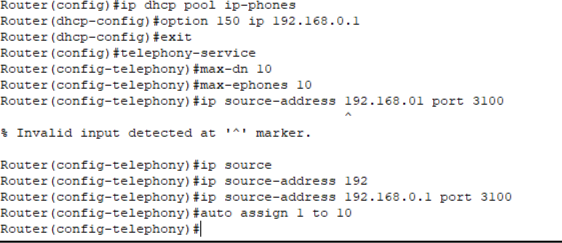
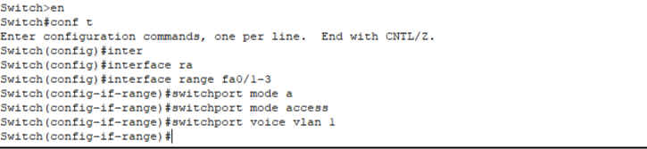
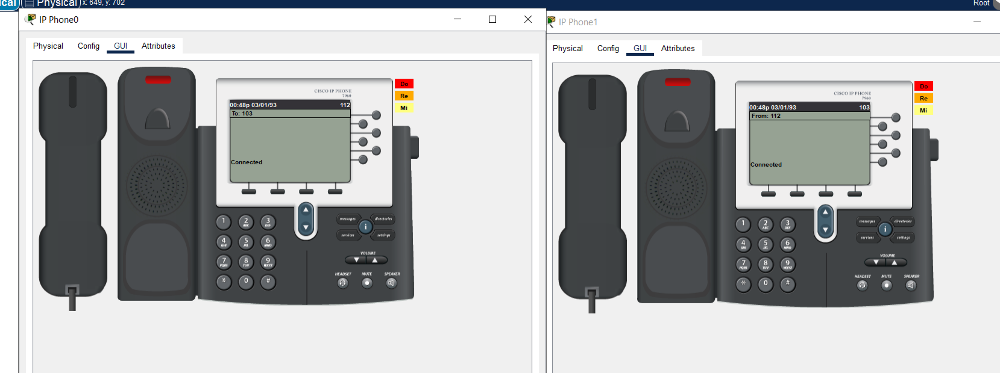

University: [ITMO University](https://itmo.ru/ru/)

Faculty: [FICT](https://fict.itmo.ru)

Course: [IP-telephony](https://github.com/itmo-ict-faculty/ip-telephony)

Year: 2024/2025

Group: K34202

Author: Gusevskaya Arina Eduardovna

Lab: Lab1

Date of create: 10.02.2025

Date of finished: 16.02.2025

# Лабораторная работа №1 "Базовая настройка ip-телефонов в среде Сisco packet tracer"

<b>Цель работы:</b> Изучить рабочую среду Cisco Packet Tracer, ознакомиться с интерфейсами основных устройств, типами кабелей, научиться собирать топологию. Изучить построение сети IP-телефонии с помощью маршрутизатора, коммутатора и IP телефонов Cisco 7960 в среде Packet tracer. 

## Ход выполнения работы 

### Часть 1

1. Соберем схему сети по заданию.

2. Выдадим ip-адреса компьютерам в диапазоне 192.168.0.1 - 192.168.0.8 включительно.

3. Поднимем интерфейсы коммутаторов.

4. Проверим связность локальной сети с помощью симуляции и пингов.

Итог: все устройства сети видят друг друга и могут отсылать пакеты. 

### Часть 2

1. Соберем исходную схему сети.

2. Настроим интерфейс fa0/0 на роутере.

3. Настроим DHCP сервер. Дополнительно пропишем option 150, чтобы автоматически подтягивать настройки для телефонов с TFTP сервера.

4. Настроим Cisco CallManager Express. Пример настройки есть в [статье](https://habr.com/ru/articles/64464/).

5. Раздадим телефонам собственные номера.

6. Назначим для vlan 1 диапазоны портов и переведем их в режиме access.

7. Проверим связность устройств с помощью режима симуляции и звонков. Проверка прошла усппшно. Телефоны принимают звонки друг от друга.

<b>Вывод:</b> в ходе выполнения данной лабораторной работы была изучена рабочая среда Cisco Packet Tracer и построение сети IP-телефонии с помощью маршрутизатора, коммутатора и IP телефонов Cisco 7960 в среде Packet tracer. 
