University: [ITMO University](https://itmo.ru/ru/)

Faculty: [FICT](https://fict.itmo.ru)

Course: [IP-telephony](https://github.com/itmo-ict-faculty/ip-telephony)

Year: 2024/2025

Group: K34202

Author: Gusevskaya Arina Eduardovna

Lab: Lab2

Date of create: 16.02.2025

Date of finished: 16.02.2025

# Лабораторная работа №2 "Конфигурация voip в среде Сisco packet tracer"

<b>Цель работы:</b> Изучить построение сети IP-телефонии с помощью маршрутизатора Cisco 2811, коммутатора Cisco catalyst 3560 и IP телефонов Cisco 7960.

## Ход выполнения работы 

### Часть 1

1. Соберем схему сети.

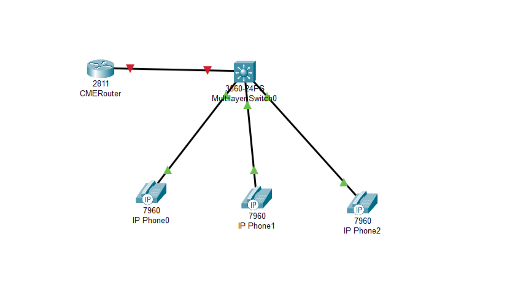

2. Отключим синтаксис ввода слов от DNS серверов.

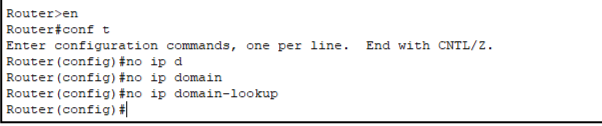

3. Зададим пароли для защиты маршрутизатора как в удаленном режиме, так и в режиме консоли. Как это сделать, написано в [статье](https://ciscotips.ru/passwords).

4. Настроим интерфейс fa0/0 на маршрутизаторе.

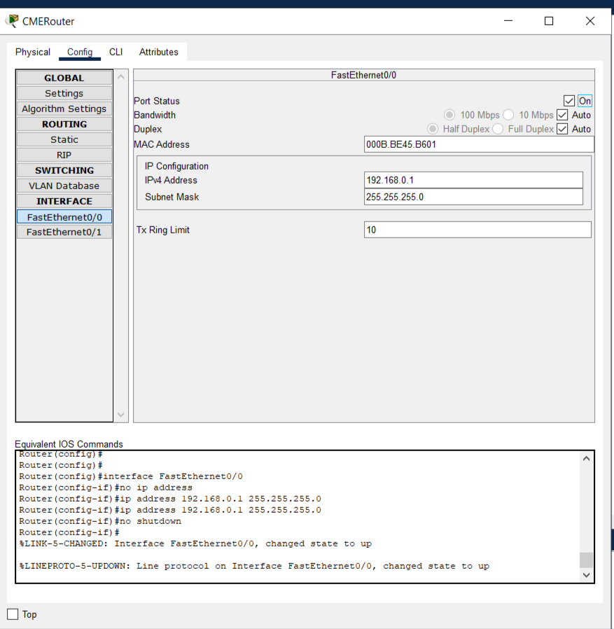

5. Аналогично лаб 1 настроим dhcp сервер для передачи голоса и данных. Дополнительно пропишем option 150, чтобы автоматически подтягивать настройки для телефонов с TFTP сервера.

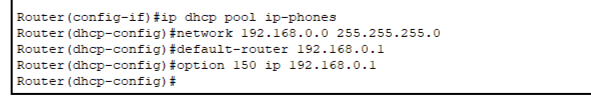

6. Настроим Cisco CallManager Express на маршрутизаторе.

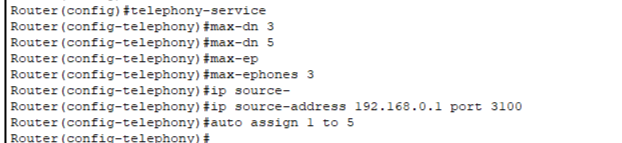

7. На коммутаторе назначим для vlan 1 диапазоны портов и раздадим телефонам собственные номера.

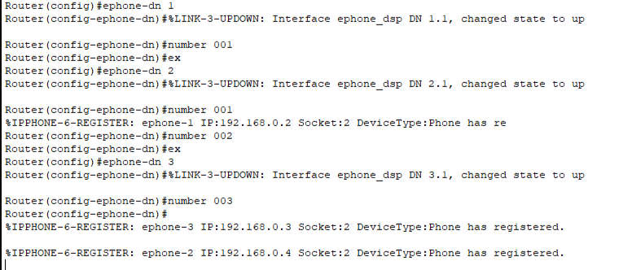

8. Убедимся, что телефоны включены и проверим связность.

Звонок с первого на второй телефон.

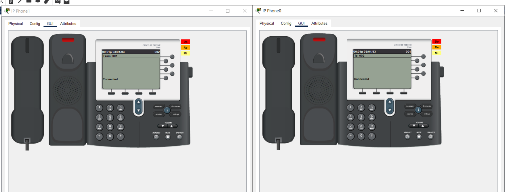

Звонок с первого на третий телефон.

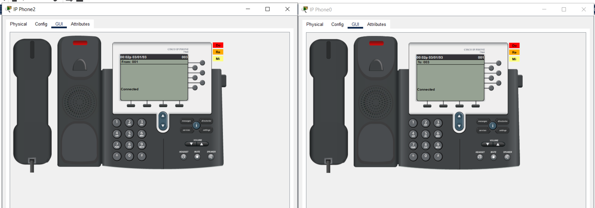

Звонок с третьего на второй телефон.

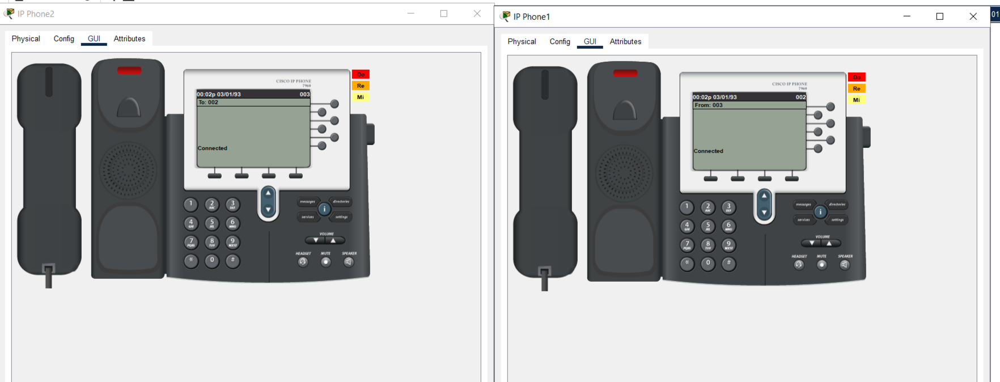

### Часть 2

1. Соберем схему сети, заданную по условию.

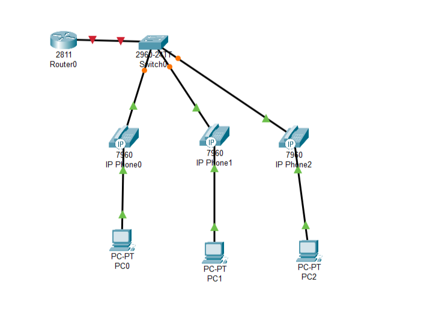

2. Создадим vlan порты на коммутаторе для взаимодействия коммутатора с маршрутизатором.

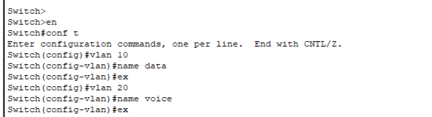

3. Укажем дефолтный маршрут.

4. Выполненим настройку портов.

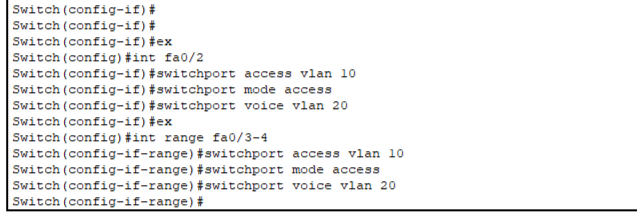

5. Настроим DHCP-сервер для передачи голоса и данных.

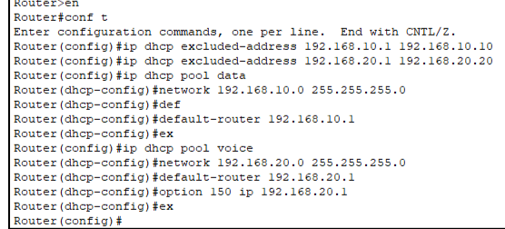

6. Настроим услуги телефони.

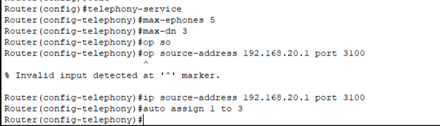

7. Выдадим телефонам собственные номера.

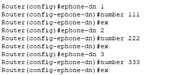

8. На компьютерах включим режим DHCP для выдачи IP-адреса.

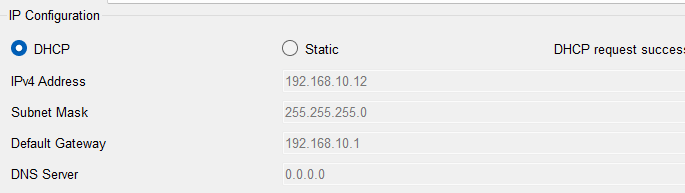

9. Адреса были автоматически выданы телефонам.

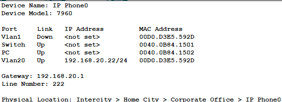

10. Проверим связность телефонов.

Звонок с первого на второй телефон

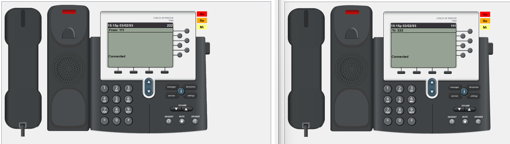

Звонок со второго на третий телефон

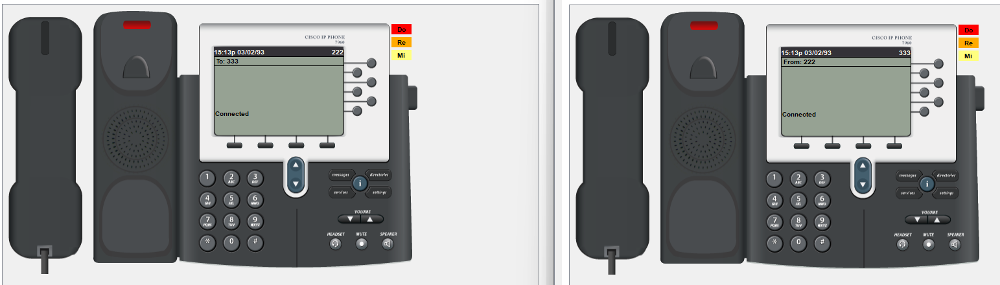

11. Проверим связность компьютеров.

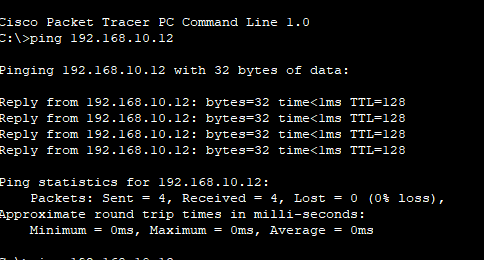

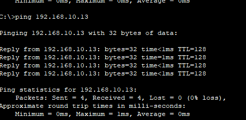

<b>Вывод:</b> В ходе выполнения данной лабораторной работы было изучено построение сети IP-телефонии с помощью маршрутизатора Cisco 2811, коммутатора Cisco catalyst 3560 и IP телефонов Cisco 7960.
