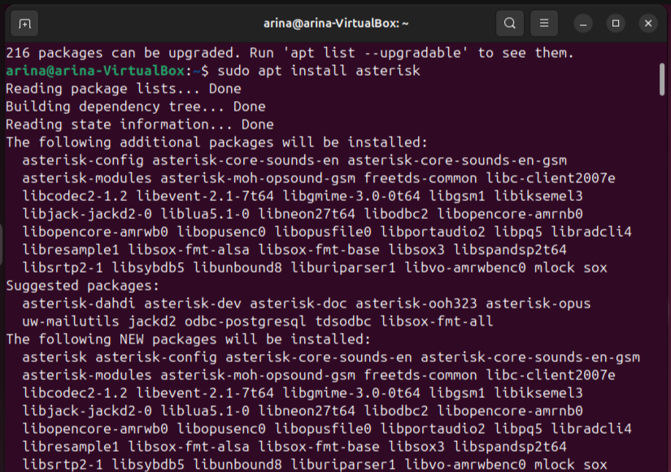

University: [ITMO University](https://itmo.ru/ru/)

Faculty: [FICT](https://fict.itmo.ru)

Course: [IP-telephony](https://github.com/itmo-ict-faculty/ip-telephony)

Year: 2024/2025

Group: K34202

Author: Gusevskaya Arina Eduardovna

Lab: Lab3

Date of create: 17.02.2025

Date of finished: 17.02.2025

# Лабораторная работа №3 "Использование Asterisk в качестве SIP proxy"

<b>Цель работы:</b> Изучить программный комплекс Asterisk. Настройка Asterisk для локальных звонков.

## Ход выполнения работы 

1. Установим Asterisk на ВМ Ubuntu, т.к. на Windows его установить нельзя.

> Asterisk — свободное решение компьютерной телефонии (в том числе, VoIP) с открытым исходным кодом от компании Digium.

2. Установиим soft телефон на рабочую станцию. Был выбран Twinkle (по результатам обзора в [статье](https://voxlink.ru/kb/ip-phones-configuration/obzor-i-sravnitelnaja-harakteristika-softfonov-na-linux/)). Мануал по программе [здесь](https://mfnboer.home.xs4all.nl/twinkle/).

3. Настроим SIP-канал. Отредактируем conf файл sip.conf, используя [руководство](https://asterisk-pbx.ru/wiki/asterisk/cf/chan_sip).

4. Отредактируем файл extentions.conf, который определяет правила маршрутизации.

5. Перезапустим сервер после изменения конфигурации и проверим созданные пиры.

6. Создадим в Twinkle соответствующие аккаунты.

7. Позвоним с одного аккаунта на другой. Зонок проходит успешно,звучит рингтон.

8. Статус пиров "онлайн".

<b>Вывод:</b> В ходе выполнения данной лабораторной работы был изучен программный комплекс Asterisk, проведена настройка Asterisk для локальных звонков.

